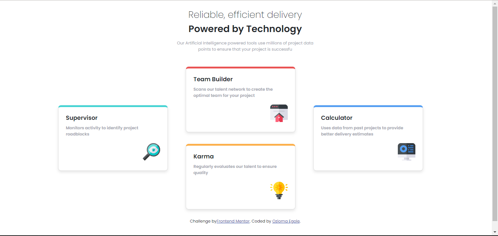
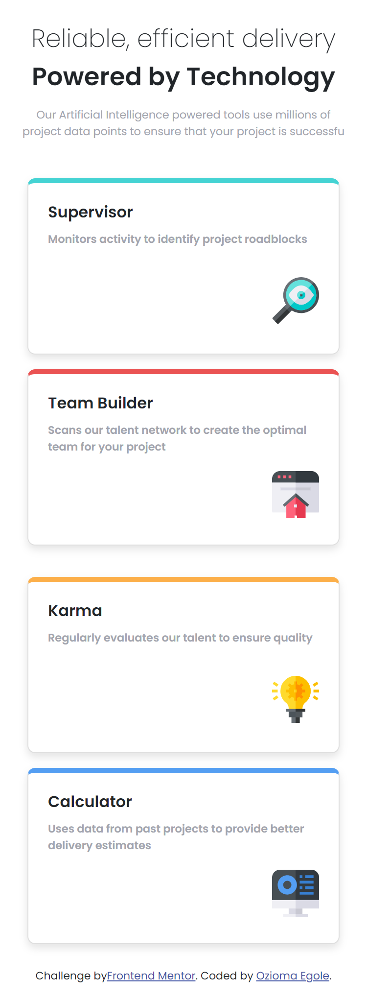

# Frontend Mentor - Four card feature section solution

This is a solution to the [Four card feature section challenge on Frontend Mentor](https://www.frontendmentor.io/challenges/four-card-feature-section-weK1eFYK). Frontend Mentor challenges help you improve your coding skills by building realistic projects.

## Table of contents

- [Overview](#overview)
  - [The challenge](#the-challenge)
  - [Screenshot](#screenshot)
  - [Links](#links)
- [My process](#my-process)
  - [Built with](#built-with)
  - [What I learned](#what-i-learned)
  - [Continued development](#continued-development)
  - [Useful resources](#useful-resources)
- [Author](#author)
- [Acknowledgments](#acknowledgments)

## Overview

### The challenge

This project involved creating a responsive four-card feature section based on a design from Frontend Mentor. It tested my skills in multi-column layouts and responsiveness, providing a valuable learning experience.
Users should be able to:

- View the optimal layout for the site depending on their device's screen size

### Screenshot

### Links

- Solution URL: [Add solution URL here](https://your-solution-url.com)
- Live Site URL: [Add live site URL here](https://your-live-site-url.com)

## My process

### Built with

- Semantic HTML5 markup
- CSS custom properties
- Flexbox
- CSS Grid
- Mobile-first workflow
- [React](https://reactjs.org/) - JS library
- [Bootstrap 5](https://getbootstrap.com/docs/5.0/getting-started/introduction/)

### What I learned

While initially challenging, tackling this project helped me gain insights into layout techniques and responsive design principles. As my first solo React project, I deliberately chose this challenge to enhance my React skills, and it proved to be a rewarding endeavor.

### Continued development

-In my future projects, I aim to deepen my expertise in frontend development, particularly focusing on mastering React and exploring other frontend technologies. I plan to undertake more projects with React to solidify my understanding and proficiency in building dynamic web applications.

-Frontend Mentor Challenges have been instrumental in my learning journey, providing practical exercises to apply and reinforce my skills. I intend to continue utilizing these challenges as a valuable resource for honing my frontend development abilities and expanding my portfolio.

## Author

- Website - [Ozioma Egole](https://ozioma45.github.io/Myportfolio/)
- Frontend Mentor - [@Ozioma45](https://www.frontendmentor.io/profile/Ozioma45)
- Twitter - [@OziomaJohn85861](https://www.twitter.com/OziomaJohn85861)
- Github - [@Ozioma45](https://github.com/Ozioma45)
- Linkedin - [@ozioma-egole](https://www.linkedin.com/in/ozioma-egole/)
